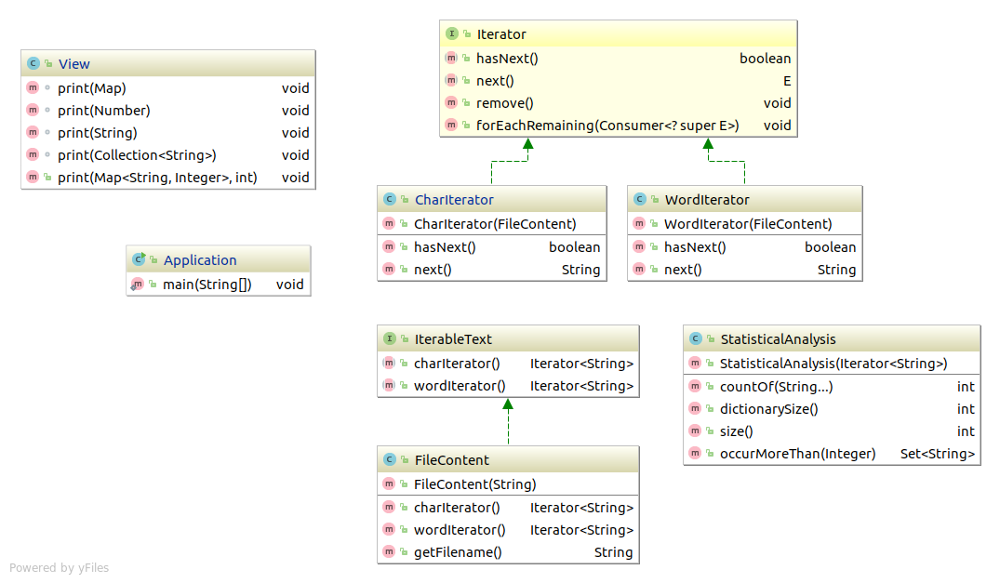

# __Text Analyser__

Your goal is to implement a tool for lexical analysis of text data.

Here’s an example of the programs usage and output with descriptions:

`| java Application text1.txt text2.txt`

``` 
==text1.txt== **name of the analyzed file

Char count: 761674 **number of characters in the file (without white-spaces)**
Word count: 188912 **number of words in the file**
Dict size: 10762 **dictionary size: number of different words used**
Most used words (>1%): [a,and,had..<more>] **all words that make up for more than 1% of the text**
'love' count: 60 **number of times that the word ‘love’ occurred**
'hate' count: 4 **number of times that the word ‘hate’ occurred**
'music' count: 4 **number of times that the word ‘music’ occurred**
vowels %: 38 **what part of all characters are vowels (a,o,i,e,u)**
'a:e count ratio' : 1.54 **the ratio of ‘a’ to ‘e’ occurrences**
[ G -> 2.16] [ R -> 5.36] ....<and the rest> **% of in whole text of all the letters

 ==text2.txt== **another file… everything like above**

Char count: 955387
Word count: 219044
Dict size: 16957
Most used words (>1%): [a,and,his,in,it,of,that,the,to]
'love' count: 24
'hate' count: 9
'music' count: 4
vowels %: 37
'a:e count ratio' : 1.49
[ M -> 2.44] [ O -> 7.27] [ B -> 1.77] …. <and the rest>
Benchmark time: 1.419 secs **Time it took the program to run**
```

## __UML__



1. Private methods are not shown on the diagram. You are free to implement any necessary/helpful private methods in any class.

2. Use the Iterator interface from java.util. You don’t have to create your own.

3. **The input files will only consist of alphabetic characters and white spaces.**

4. The input file will consist both upper and lower case characters. You should use only one case to ensure that the results of the analysis will be consistent.

## __Classes to implement:__

- `IterableText` interface. Create the interface with required methods.

- `FileContent` - class responsible for reading text files and providing its content through implementing IterableText interface. The content will be provided through methods `charIterator()` and `wordIterator()`.

- `CharIterator` successively iterates over alphabetic characters (single letters) of the text. It skips all other characters (like white-spaces). Implements next() and hasNext() from `Iterator` interface. 
_NOTE_: Chars are represented as Strings for the sake of simplicity. Remember that characters’ case (UPPER or lower) should be consistent in our analysis.

- `WordIterator` successively iterates over words of the text. Words in the text are separated with white-spaces. Implements `next()` and `hasNext()` from `Iterator` interface.

- `StatisticalAnalysis` is the dataset. It is initialized with `Iterator` and provides functions for statistical analysis of the text elements (Strings).
_NOTE_: You may choose any data structure to store the processed data. The choice will affect the amount of code you will have to write.
    - `countOf(String… elems`) function returns sum of all occurrences (in the dataset) of the elements given as arguments ( elems). 
    _Note_: One string may be given as well. The three-dots operator will help you pass variable number of arguments to the function and access them with ease. https://docs.oracle.com/javase/tutorial/java/javaOO/arguments.html#varargs

    - `dictionarySize()` function returns the number of unique elements of the dataset. It’s the size so-called Author’s Dictionary - the set of different words the author of the text uses.

    - `size()` returns the total number of all elements in the dataset. This will be total number of words or total number of characters.

    - `occurMoreThan(Integer n )` returns all the elements that occur more than n _times _ in the dataset

- `View` this class should be responsible for presenting the data to the user. You are free to implement any functions you find sensible.
_NOTE_: In case of this class you don’t have to follow the UML diagram.

- `Application` main class of the program. It should allow the user to pass to text files for analysis as CLI arguments. 

- Handle only those exceptions which are required to be handled by the functions and methods you use. Custom error messages are not required (printStackTrace() can be used).

- The structure of packages tree is not restricted by anything but clean code principles.